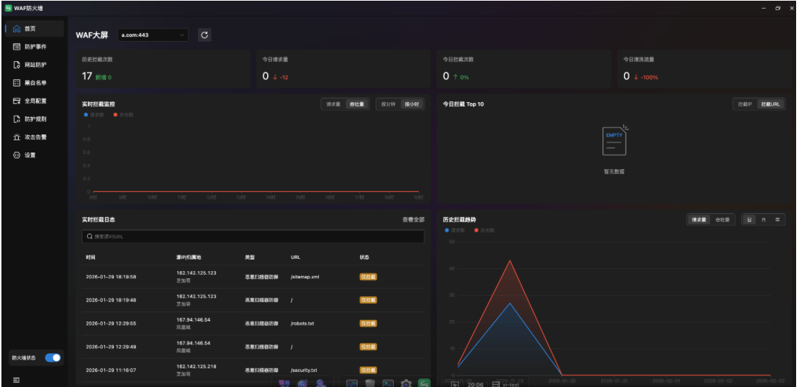
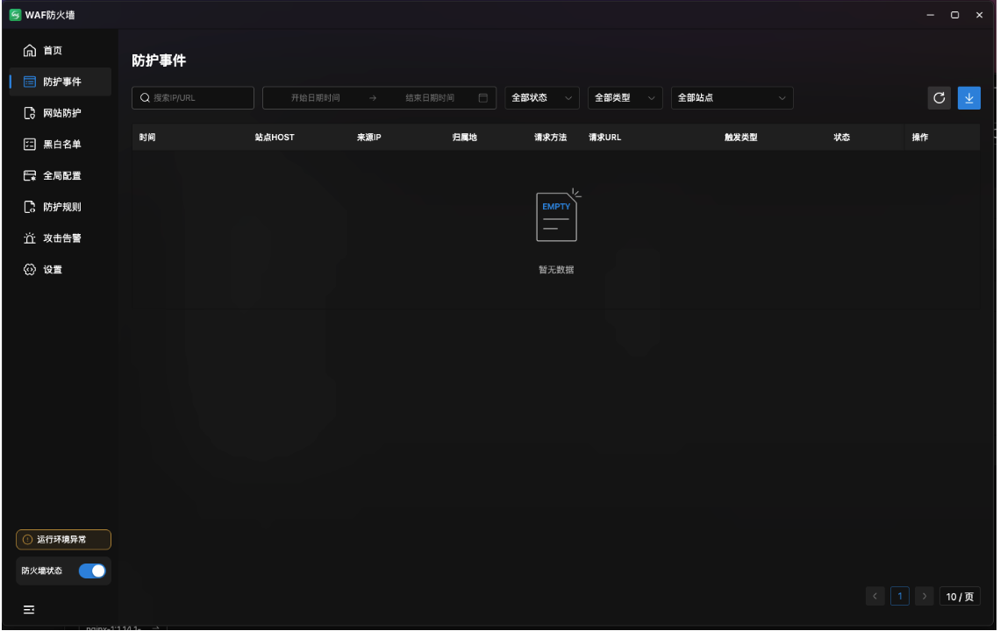
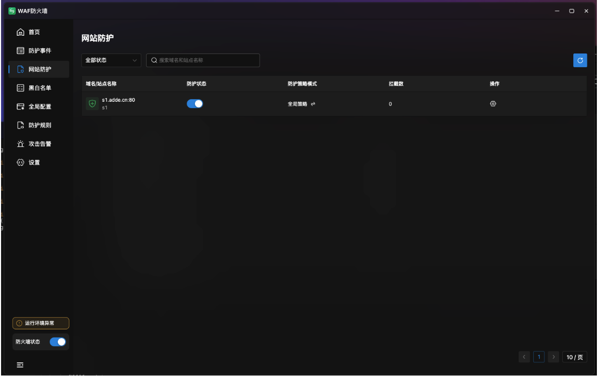
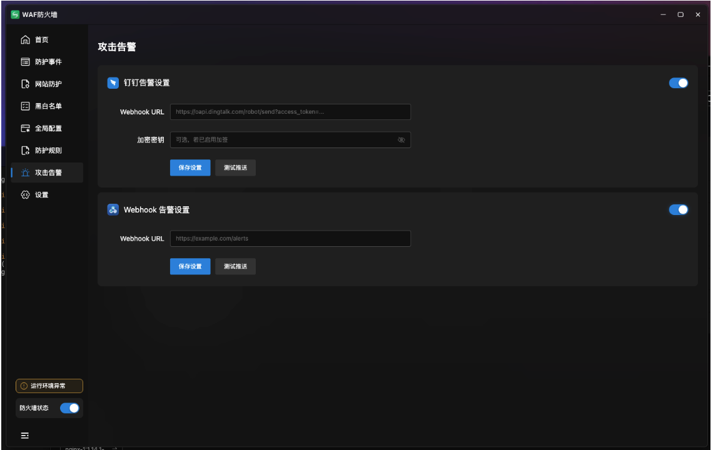

# WAF-FOR-GMSSH (Nginx-Lua Edition)

**基于 ngx_lua 模块开发的高性能动态 Web 应用防火墙**
**A high-performance dynamic WAF powered by `ngx_lua`.**

- en_US [English](README_EN.md)
- zh_CN [简体中文](README.md)
---

## 📖 项目简介 | Description

本项目是专为 **GMSSH** 生态定制的高性能安全防护引擎。通过集成 `ngx_lua` 模块，在 Nginx 请求处理的 Access 阶段进行实时流量过滤，为服务器提供针对 SQL 注入、XSS 跨站脚本及 CC 攻击的深度防御能力。


## 🌟 研发背后的故事 | Background

作为一名拥有多台服务器的开发者，我深感市面上主流 WAF 产品高昂的授权费用对个人开发者及小微企业并不友好。在寻求更具性价比的安全方案时，我偶然接触到了 **GMSSH 开发者中心**。

GMSSH 开放的生态准入、无需繁琐审核的开发流程，以及官方提供的便捷 SDK，让我能够将精力完全集中在核心安全逻辑的构建与 UI 交互的打磨上。基于此，我开发了这款专为 GMSSH 打造的 WAF 插件，并已正式上架官方应用中心。

**值得一提的是：** 虽然本项目深度适配了 GMSSH，但它同样支持在**标准 Linux 环境**下运行。无需任何代码修改，只需将 Lua 脚本部署至 Nginx 模块即可实现同等的防护能力。

## ✨ 深度优化功能简介 | Enhanced Features

### 1. 极致兼容与快速部署 (Advanced Deployment)

* **多版本 Nginx 自动适配**：突破了原版环境限制，完美适配从 Nginx 1.12.0 到 1.28.1 的数十个编译版本。
* **零平台依赖**：代码实现全面解耦，无特定平台捆绑，确保在各种标准 Linux 环境下均能稳定运行。

### 2. 智能环境自检与加固 (Smart Health Check)

* **异常自动校验**：新增环境检测脚本，可自动校验 Nginx 服务状态、Lua 版本匹配度及关键依赖库的完整性。
* **故障快速定位**：当运行环境出现异常时，系统会提供直观的错误提示并引导一键管理或切换版本，极大降低了运维门槛。

### 3. 精准防御与深度洞察 (Precision Defense)

* **高精度 IP 库集成**：引入更精准的 IP 地理位置库，告警日志不仅显示攻击类型，还能精确识别攻击者的所属国家、省市、ISP（电信/联通等）及归属地信息。
* **全方位区域限制**：支持极其细化的地理围栏策略，可一键勾选拦截/放行全部海外地区、全部国内省市，或自定义选择具体的国际都市（如纽约、伦敦、东京）和国内城市。

### 4. 交互革命与国际化视角 (UX & Internationalization)

* **简化名单管理**：重构了黑白名单逻辑，支持 IP、UA、URL、人机验证等多种类型的动态更新，并支持一处添加、多处复用的批量设置模式。
* **原生国际化支持**：界面全面适配多语言切换，无论是看板、日志还是配置项，均提供标准的中英文双语交互，满足全球化运维需求。
* **可视化策略配置**：全局设置模块经过逻辑拆分，将防 CC、请求合规、防注入、资源滥用等功能开关模块化，操作直观，真正实现无需文档、上手即用。

### 5. 实时监控与智能告警 (Real-time Analytics)

* **多维数据大屏**：提供全量看板，实时展现拦截趋势（分钟/小时级）、今日拦截 Top 10 IP/URL 以及详细的实时拦截日志。
* **全渠道即时告警**：支持钉钉 Webhook 等多种告警方式，确保在遭受攻击时，管理员能通过移动端实时获取详细的攻击报文和来源信息。

## 🚀 核心功能简介 | Core Functionalities

* **极速响应 (Ultra-High Performance):** 充分利用 LuaJIT 性能，对业务访问实现近乎“零延迟”的透明防护。
* **规则透明 (Transparent Logic):** 过滤逻辑完全开源，支持开发者根据业务需求高度定制防御规则。
* **智能 CC 防御 (Smart CC Protection):** 基于 `Shared Dict` 共享内存机制，实现精准的并发请求与访问频率控制。
* **无缝集成 (Seamless Integration):** 深度适配 GMSSH 管理体系，显著降低安全运维的准入门槛。

### 📊 1. 可视化安全大屏 (Security Dashboard)

* **全局态势感知**：实时监控历史拦截总数、今日请求量、今日拦截次数及清洗流量，防御效果一目了然。

* **多维数据分析**：内置实时拦截监控（请求数 vs 攻击数）、今日拦截 Top 10（IP/URL）、实时拦截日志以及历史趋势分析，助力精准决策。

  

### 🛡️ 2. 全方位防护矩阵 (Comprehensive Protection)

* **网站防御管理**：支持多站点独立防护开关，灵活配置全局或自定义防御策略模式。
* **深度黑白名单**：支持 IP、UA、URL 等多维度黑白名单设置，支持 CIDR 地址段及 IP 范围批量导入，精准控制访问权限。
* **地区/流量限制**：支持国内外省市精细化地理位置拦截（放行/拦截），内置流量限制、专属限制及自定义规则引擎，满足复杂业务需求。
* **独特的IP地址库**，定时一个月更新一次最新IP库。





### ⚡ 3. 极简全局配置 (One-Click Global Configuration)

* **场景化防御拆分**：针对不同攻击类型进行逻辑拆分，包括：
  * **防 CC 攻击**：支持 URL 级 CC 防御、URL 人机验证及 API 接口专项防御。
  * **规范防御**：请求合规性校验、SQL 注入防御。
  * **资源保护**：防资源滥用、防自动化爬虫扫描。
  * **内容安全**：敏感词过滤及目录扫描防御。
* **即装即用**：所有配置均采用开关式设计，无需编写复杂脚本，实现零门槛安全运维。

### 🔔 4. 智能告警与合规 (Intelligent Alerting)

* **多渠道联动**：内置钉钉 (DingTalk) 及标准 Webhook 告警支持，攻击事件实时推送，确保风险第一时间被感知。
* **CDN 深度适配**：支持从 Header 列表（如 `cf-connecting-ip`, `x-forwarded-for` 等）精准获取真实访问 IP，完美兼容各类主流 CDN 环境。
* **护网模式 (HW Mode)**：支持一键开启“只读防护模式”，在特殊敏感时期提供最高级别的安全加固。



---

## 🚀 快速开始 | Quick Start

### 1. 获取代码

```bash
git clone https://github.com/CodePen01/waf-for-gmssh.git

```

### 2. 部署方案

#### **方案 A：生产环境集成 (Standard Nginx)**

1. 确保 Nginx 已编译 `lua-nginx-module`。
2. 将 `lua` 脚本放置于 Nginx 配置目录。
3. 在 `nginx.conf` 的 `http` 段落中通过 `access_by_lua_file` 引入核心拦截逻辑。

#### **方案 B：GMSSH 开发者调试 (Development & Debug)**

1. **启动后端服务：**
```bash
cd gmssh-for-waf/waf-backend/backend
# 创建并激活虚拟环境
python3 -m venv .venv && source .venv/bin/activate
# 安装依赖
pip3 install -r requirements.txt
# 启动后端进程
python3 main.py
```

2. **应用中心配置：**
* 打开 **开发调试工具**，创建一个前后端应用。
* **应用名称：** `kele/safewaf`
* **访问地址：** 下载前端项目至本地，使用 VSCode "Live Server" 启动，并输入对应的本地访问地址。
* **Socket 路径：** 输入上述 Python 后端服务启动时生成的 Socket 路径。

3. **完成启动：** 点击确定后，即可在 GMSSH 环境中开始 WAF 的调试与运行。


## 📅 开发计划 | Roadmap

本项目并非一时的"代码复现"，我希望将其打造成一个真正好用、普惠、免费的开源安全工具。以下是我接下来的开发重心，欢迎志同道合的朋友一起参与。

* **容器化部署 (Dockerization):** 我正在构建 Docker 镜像，目标是实现一键拉取镜像即可完成 WAF 节点的云端部署，方便大家进行多站点、集群化的安全管理。

* **全场景系统适配 (Multi-OS Support):** 接下来我会投入精力优化在 NAS 系统（群晖、威联通等）、旧版 CentOS (7以下) 以及国产服务器操作系统上的表现，让各种环境都能享受到同等的防护。

* **极致性能调优 (Performance Tuning):** 计划进一步重构核心 Lua 拦截逻辑以降低高并发下的 CPU 占用，并保持攻击指纹库的持续更新。

## 🤝 优化建议与反馈 | Feedback

本项目由社区开发者驱动。如果您有任何优化建议、发现 Bug 或有新的防护场景需求：

1. 请直接在本项目中 **[提交 Issue]**。
2. 欢迎提交 **Pull Request**，您的每一行代码贡献都将列入项目贡献者名单。

## ⚖ 开源协议 | License

本项目采用 [GPL-3.0 License](https://opensource.org/licenses/GPL-3.0) 协议开源。
请在引用或二次开发时，自觉遵守协议要求，保留对原作者及上述参考来源的署名。

## 🛠 开发背景与致谢 | Acknowledgments

本着“拥抱开源，不重复造轮子”的初心，本项目在研发过程中深度参考了行业内成熟的 Nginx-Lua 方案。

### **致谢声明 (Statement of Gratitude)：**

本项目的核心架构与规则过滤逻辑，主要受益于以下优秀开源成果：

* 宝塔面板 (BT.cn) WAF 核心脚本：本项目继承了其稳健的过滤算法，并针对 GMSSH 运行环境进行了深度的变量适配与底层性能优化。
* loveshell/ngx_lua_waf：参考了其经典的 Lua 拦截处理流设计。

**特别说明：**
在早期开发与兼容性测试阶段，为确保与主流运维环境（如宝塔生态）的逻辑衔接，代码中保留了部分变量命名习惯。目前，开源版本已完成初步的规范化清理与重构。向所有开源先行者致敬。
经GMSSH联系到我方，我方积极配合配合修改完善部分代码逻辑。
